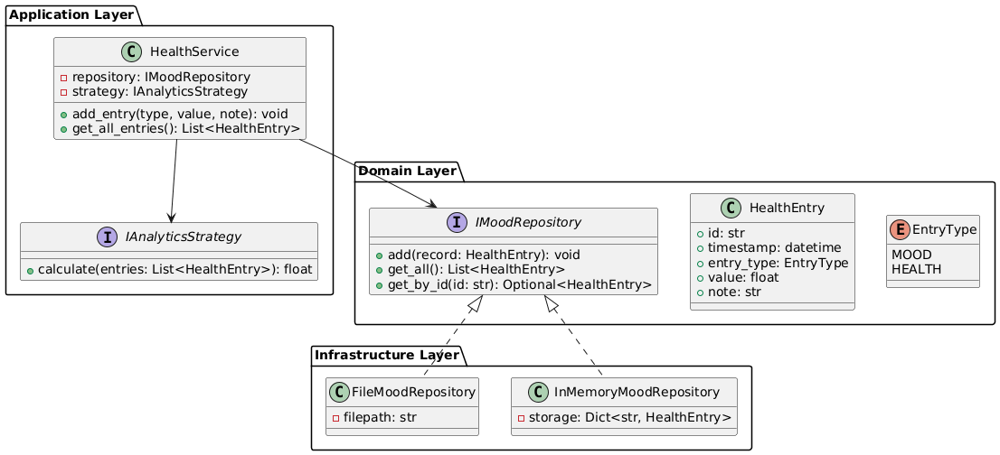
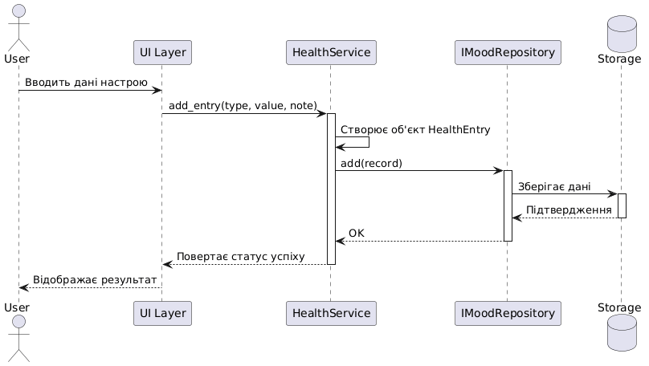

# МОБІЛЬНИЙ щоденник настрою і здоров'я

Цей проєкт — аналітичний застосунок для відстеження стану здоров'я та настрою користувача. Проєкт реалізований з дотриманням принципів Clean Architecture, SOLID та використанням автоматизованих тестів.

## 🛠 Технології
* **Мова:** Python 3.12+
* **UI Framework:** Flet (Material Design)
* **Тестування:** pytest, pytest-cov
* **Аналіз якості:** SonarQube / SonarCloud
* **CI/CD:** GitHub Actions

Діаграма класів:

Поведінкова діаграма: 
